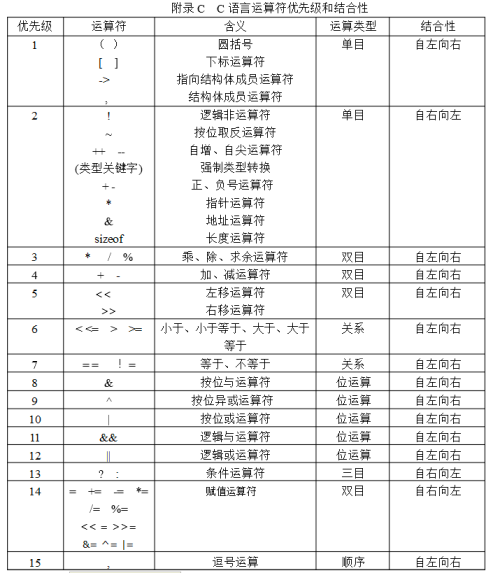

== 运算符优先级表

总结
同一优先级的运算符，运算次序由结合方向所决定。

== 参考
[%hardbreaks]
https://github.com/gnipbao/iblog/issues/31[C语言运算符优先级巧记]
https://gaomf.cn/2016/04/08/C%E8%AF%AD%E8%A8%80%E8%BF%90%E7%AE%97%E7%AC%A6%E4%BC%98%E5%85%88%E7%BA%A7%E4%B8%8E%E7%BB%93%E5%90%88%E6%80%A7/[C语言运算符优先级与结合性]